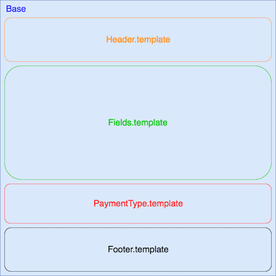

# Adfinitas-tmk-payment
## Présentation

Cette application permet d'intégrer un formulaire de paiement en ligne personnalisable sur une page.

Deux modes de paiement sont disponibles:
* <b>Unique</b>  
* <b>mensuel</b>   

## CONFIGURATION GÉNÉRALE

###### Ajouter le formulaire à un site

1. Inclure les 6 scripts dans votre page à la fin de la balise ```<body>``` par soucis d'optimisation ainsi que liens vers les fichier css à la fin de la balise ```head``` (voir un [exemple d'index.html](client/index.html)):
````html
<script src="https://cdnjs.cloudflare.com/ajax/libs/jquery/2.2.4/jquery.min.js" type="text/javascript"></script>
<script src="assets/js/libs.min.js" type="text/javascript"></script>
<script src="assets/js/submitForm.js" type="text/javascript"></script>
<script src="assets/js/validateForm.js" type="text/javascript"></script>
<script src="/socket.io/socket.io.js" type="text/javascript"></script>
<script src="assets/js/main.js" type="text/javascript"></script>
````

````html
<link rel="stylesheet" type="text/css" title="stylesheet" href="assets/css/intlTelInput.css" />
<link rel="stylesheet" type="text/css" title="stylesheet" href="assets/css/foundation.min.css" />
<link rel="stylesheet" type="text/css" title="stylesheet" href="assets/css/form.css" />
````

2. Configurer le fichier settings.cfg (cf. [Configuration Settings](#configuration-settings))

3. Configurer les templates du formulaire (cf. [Configuration Templates](#configuration-templates))

## CONFIGURATION SETTINGS

Exemple de fichier de configuration:
````JSON
{
	"WRAPPER_JQ_SELECTOR"		: "#view",
	"UNIQUE_DONATION"		: {
		"AMOUNT_1"	: "2300",
		"AMOUNT_2"	: "1500",
		"AMOUNT_3"	: "5800"
	},
	"MONTHLY_DONATION"		: {
		"AMOUNT_1"	: "300",
		"AMOUNT_2"	: "1000",
		"AMOUNT_3"	: "2800"
	},
	"URL"				: "{{ ADFINITAS.FR }}",
	"SITE_NAME"			: "{{ ADFINITAS }}"
}
````

```WRAPPER_JQ_SELECTOR```: Selecteur jQuery de la balise où sera inséré le formulaire <br/>
```UNIQUE_DONATION -> AMOUNT_X```: Montant à afficher pour le mode de paiement <b>unique</b> (2300 = 23.00€) <br/>
```MONTHLY_DONATION -> AMOUNT_X```: Montant à afficher pour le mode de paiement <b>mensuel</b> <br/>
```URL```: URL à mentionner dans le footer <br/>
```SITE_NAME```: Nom du site à mentionner dans le footer <br/>

## CONFIGURATION TEMPLATES

Le formulaire est découpé en plusieurs parties :

* La base : [form.template](client/assets/layouts/form.template)
* Le header : [header.template](client/assets/layouts/header.template)  
* Les champs : [fields.template](client/assets/layouts/fields.template)  
* Le type de paiement : [paymentType.template](client/assets/layouts/paymentType.template)  
* Le footer : [footer.template](client/assets/layouts/footer.template)


Pour modifier le code HTML du formulaire, il faut modifier ces fichiers.

Afin d'améliorer l'expérience du visiteur, il est nécessaire que les balises d'entrées (input, select) aient la classe ```field``` et aient une balise parente ayant la classe ```input-container```.
Cela permet de vérifier la validité des entrées en temps réel.

## AJOUTER UN CHAMPS

1. Insérez le code html du champs sous cette forme :
````html
<div class="input-container">
	<input type="Your type" name="Your_field_name" placeholder="Your placeholder"  class="field"/>
</div>
````

2. Ajouter les conditions de validations du champs:
Ajouter un objet javascript dans la variable data dans la fonction getDataValidation sous cette forme dans un des templates:
````javascript
var data = {
	field_name	: {
		selector		: $('input[name="field_name"]'),
		borderSelector		: $('input[name="field_name"]').closest('.input-container'),
		required		: {
			message: 'Veuillez entrer un field_name'
		},
		pattern			: {
			regex: /^(Hello|World)$/,
			message: 'Veuillez entrer un field_name valide.'
		},
			extra		: function (value) {
			if (value < 0) {
				return false;
			} else {
				return true;
			}
		}
	}
}
````
Légende:
* ```Selector:``` Selecteur jQuery du champs.
* ```BorderSelector:``` Selecteur jQuery du conteneur du champs, celui qui aurales bordures indiqué le status de validité.
* ```Required:``` Si le champs est obligatoire, mettre sa valeur à { message : "Votre message d'erreur"}, sinon s'il est optionnel, mettre undefined.
* ```Pattern:``` Regex a tester lors de la validation. si il n'y a pas de regex, peut être défini a undefined
* ```extra:``` fonction permettant de tester ce que l'on souhaite, elle prend en paramètre la valeur du champs, elle retourne true en cas de succès et false en cas d'erreur.
A venir: Ajouter / retirer des champs
